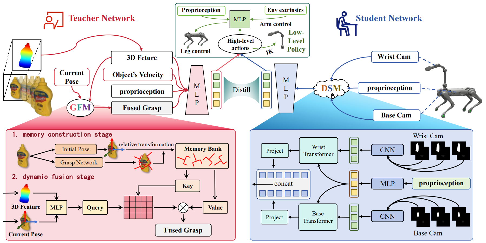

**[Project Page](https://kolakivy.github.io/DQ/)** | **[arXiv](https://arxiv.org/abs/2508.08328)**

**[Qiwei Liang](https://kolakivy.github.io/)**,Boyang Cai,Rongyi He, Hui Li, Tao Teng, [Haihan Duan](https://duanhaihan.github.io/), Changxin Huang, **[Runhao Zeng](https://zengrunhao.com/)***

**Association for the Advancement of Artificial Intelligence(AAAI)  2026**

<p align="center">

</p>

**Clarification**: Our project is highly based on work--[VBC](https://github.com/Ericonaldo/visual_wholebody)

# 💻 Installation
## Set up the environment
```bash
conda create -n dqwbc python=3.8 # isaacgym requires python <=3.8
conda activate dqwbc

git clone https://github.com/YoungYNG/DQ_WBC.git

cd DQ_WBC

pip install torch torchvision torchaudio

cd third_party/isaacgym/python && pip install -e .

cd ../..
cd rsl_rl && pip install -e .

cd ..
cd skrl && pip install -e .

cd ../..
cd DQ_low-level && pip install -e .

pip install numpy pydelatin tqdm imageio-ffmpeg opencv-python wandb scipy termcolor
```

# 🛠️ Usage
### Low-level training
This part you can totally refer to [VBC's Low-level introduction](https://github.com/Ericonaldo/visual_wholebody/tree/main/low-level)

**Note**:We made changes to the **low-level** part of the VBC work mainly by **expanding the value ranges** of `delta_orn_r`, `delta_orn_p`, and `delta_orn_y` in `low-level/legged_gym/envs/manip_loco/b1z1_config.py`

### High-level training and eval
1. Train DQ_teacher:
```bash
   python train_multistate_DQ_teacher.py --rl_device cuda:0 --sim_device cuda:0 --timesteps 120000  --task B1Z1PickMulti --experiment_dir DQ_teacher/b1-pick-multi-teacher01 --roboinfo --observe_gait_commands --small_value_set_zero --rand_control --headless
   ```
2. Play DQ_teacher:
   ```bash
   python play_multistate_DQ_teacher.py --task B1Z1PickMulti --checkpoint your_teacher_checkpoint_path --roboinfo --observe_gait_commands --small_value_set_zero --rand_control --rl_device cuda:0 --sim_device cuda:0   --headless
   ```
3. Train DQ_stu:
   ```bash
   python train_multi_bc_deter_DQ_stu.py --task B1Z1PickMulti --rl_device cuda:0 --sim_device cuda:0 --timesteps 240000 --experiment_dir DQ_opensource/b1-pick-multi-stu_transformer_grasp_have_vel_test01 --teacher_ckpt_path  your_teacher_checkpoint_path --roboinfo --observe_gait_commands --small_value_set_zero --rand_control --headless
   ```
4. Play DQ_stu:
   ```bash
   python play_multi_bc_deter_DQ_stu.py --task B1Z1PickMulti --checkpoint your_stu_checkpoint_path --roboinfo --observe_gait_commands --small_value_set_zero --rand_control --rl_device cuda:0 --sim_device cuda:0   --headless
   ```

### Change the DQ_Bench Level:
You can easily make this by just modifying the config file:`DQ_WBC/DQ_high-level/data/cfg/DQ_stu.yaml`,`DQ_WBC/DQ_high-level/data/cfg/DQ_teacher.yaml`


# 📝 Citation

[](https://github.com/YanjieZe/3D-Diffusion-Policy/tree/master#-citation)

If you find our work useful, please consider citing:

```
@article{liang2025whole,
  title={Whole-Body Coordination for Dynamic Object Grasping with Legged Manipulators},
  author={Liang, Qiwei and Cai, Boyang and He, Rongyi and Li, Hui and Teng, Tao and Duan, Haihan and Huang, Changxin and Zeng, Runhao},
  journal={arXiv preprint arXiv:2508.08328},
  year={2025}
}
```
